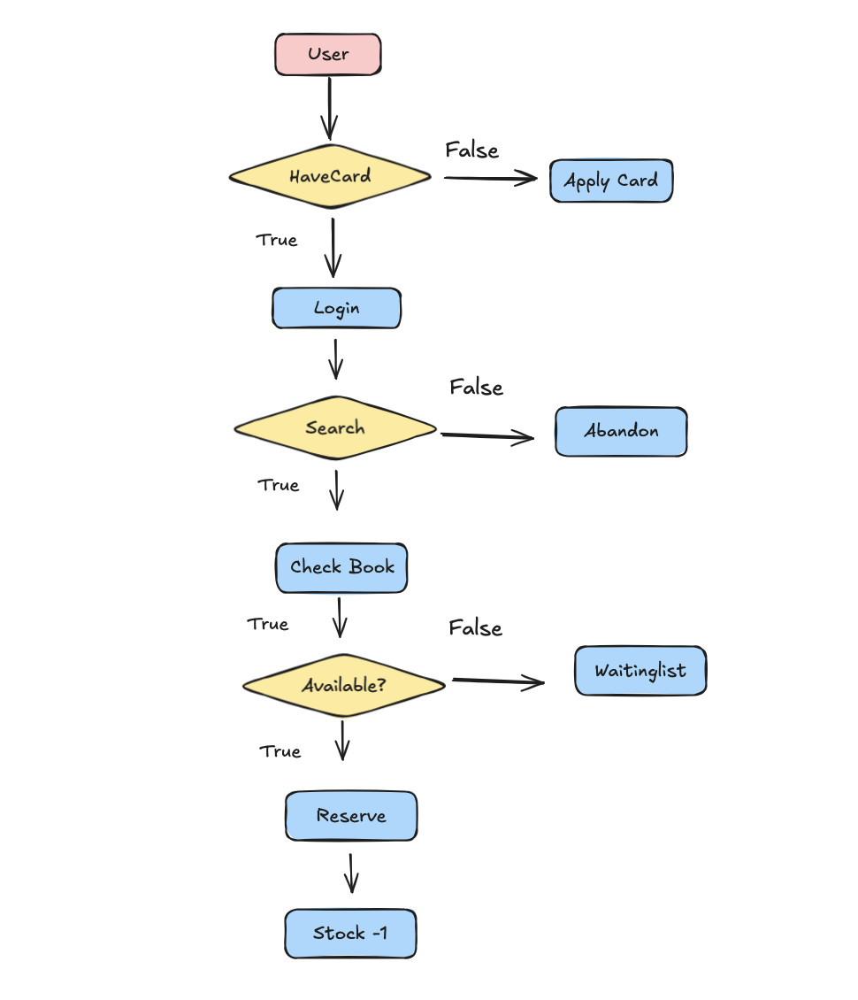

# Vallejo Public Library Website

This project is a prototype website for the Vallejo Public Library.  
It demonstrates the use of **semantic HTML**, simple navigation, and a basic book reservation system.

## Website Map

## Diagram

## Image Credits

- [Interior view of library](https://www.pexels.com/photo/interior-view-of-library-1837726/) — Photo from Pexels  
- [Books in library](https://www.pexels.com/photo/books-in-library-3747516/) — Photo from Pexels  
- [Students reading books in a library](https://www.pexels.com/photo/students-reading-books-in-a-library-8926840/) — Photo from Pexels  
